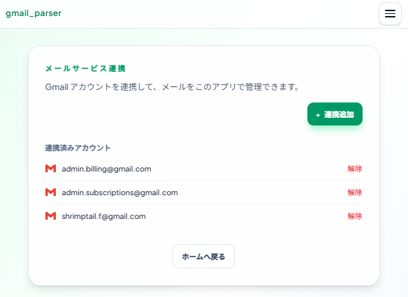
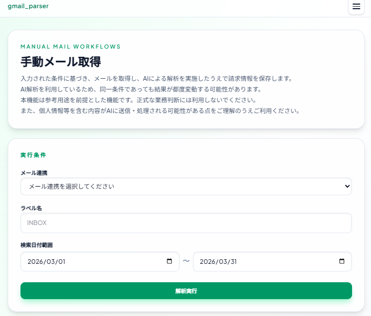
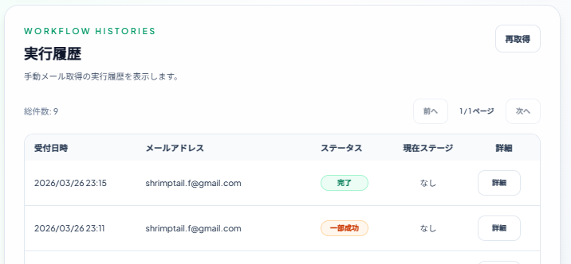
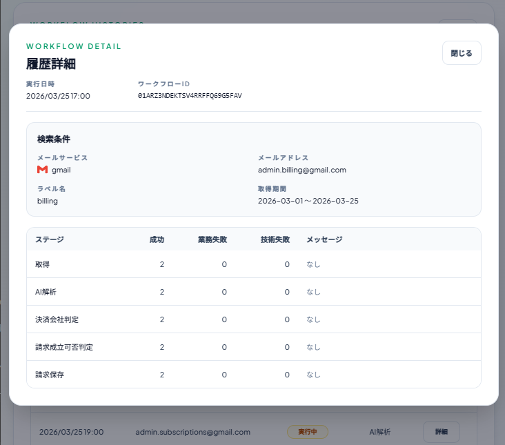
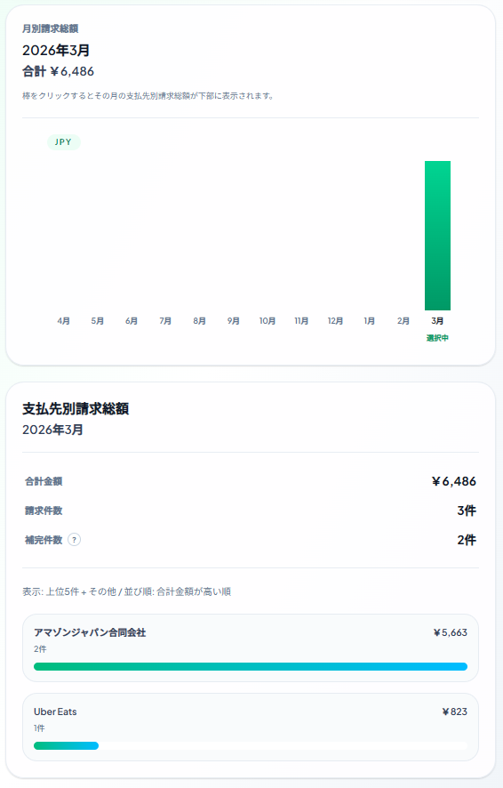
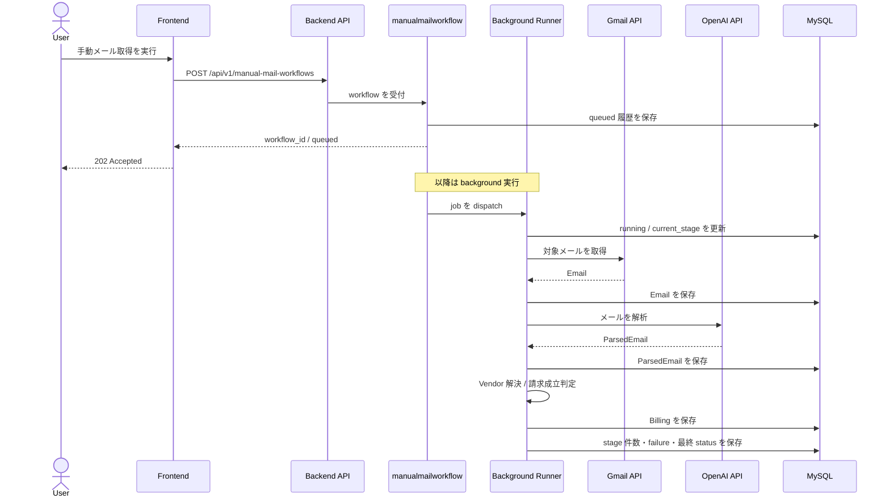
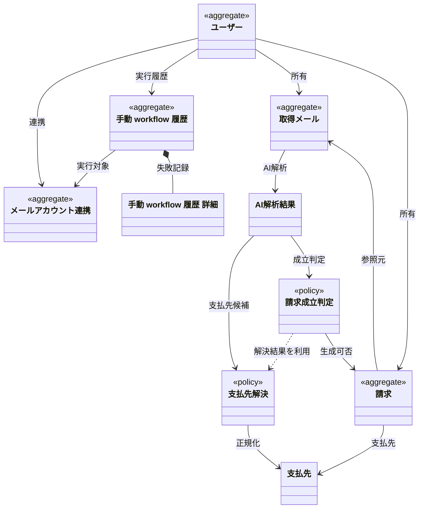

# billingrse とは

名前は billing と parser を合わせた造語です

Gmailから請求メールを取得し、AI解析を行ったうえで保存し、請求を検索・集計ができます。  
※本リポジトリは`billingrse`の`Go製バックエンド`です  
非構造なメール本文を、あとから追跡できる請求データへ変換することを目的にしています

- 非構造メールを請求データへ変換
- stage 分離で責務を明確化
- テスト独立性・構造化ログ・ custom lint まで整備

## このプロジェクトが解く課題

本プロジェクトは下記課題を解決し、
複数メールサービス・複数アカウントの請求メールを集計・確認するソリューションを提供します。

- SaaS や各種支払いに関するメールは受信箱に散在しやすく、あとから検索・集計・重複確認しづらい
- 複数メールサービス・複数アカウントにまたがって情報を集約するのが難しい
- メール本文は非構造データなので、そのままでは請求一覧や月次比較に使いづらい
- AI 解析だけでは業務データとして不十分で、支払先の正規化、請求成立判定、監査可能な履歴設計が別途必要になる

## 主要ユースケース

1. アカウント登録・メール認証
2. Gmailアカウント連携
3. 手動メール取得実行
4. 手動メール取得の実行履歴にて請求の解析状況確認
5. 請求の年/月推移・月次集計

### Gmailアカウント連携
OAuth2 で Gmail と接続し、対象メール取得の準備を行う  


### 手動メール取得実行
対象条件に応じて`workflow`を起動する  


### 連携履歴一覧
実行した`workflow`の進捗状況を監査可能にする  


### 連携履歴詳細
実行した`workflow`の各Stageの処理状況・失敗件数とその理由を監査可能にする  


### 年/月推移・月次集計
請求を年/月推移・月次単位で確認可能  


<!-- TODO: インフラ構成図ができたら乗せる -->
<!-- ## システム全体図
> 図はここに配置予定 -->

## 主要処理のフロー図

手動メール取得のフローを記載しています



## ディレクトリ構成

クリーンアーキテクチャを採用しています

```
project root
├── internal
│   ├── app
│   │   ├── presentation/{domain} HTTPリクエストを処理する
│   │   ├── router API URLを定義
│   │   └── server APIサーバー起動
│   ├── di 依存注入
│   ├── common
│   │   └── domain DDDドメインモデル
│   ├── {domain}
│   │   ├── application 技術的関心と業務知識を統合
│   │   ├── domain {domain}で使うドメイン・DTO
│   │   └── infrastructure 外部依存を実装
│   └── library 外部依存・時間・環境変数のラッパー
└── tools migration・seeder・custom linter等の便利ツール置き場
```

## 使用技術

- Language: Go
- Framework: Gin
- ORM: Gorm
- DI: `go.uber.org/dig`
- Auth: JWT, Gmail OAuth2
- External APIs: Gmail API, OpenAI API
- RDS: MySQL
- NoSQL: Redis
- Log: `Zap`
- Testing: `testify` scenario tests
- Lint: golangci-lint
- Custom Tooling: `dicheck`, `nplusonecheck`
- Migration Version Manage: Atlas
- Tooling: Taskfile, Air, GitHub Actions

<!-- ## ER図 -->
<!-- TODO: あとで作る -->


## DDD クラス図

README では概念レベルの関係だけを抜粋しています  
詳細版は [docs/ddd/README.md](./docs/ddd/README.md) を参照してください


主要な永続化・ドメイン上の関心は次の通りです

- `User`: 認証とデータ分離の単位
- `MailAccountConnection`: Gmail 連携情報を保持する境界
- `Email`: 取得したメールの正本
- `ParsedEmail`: AI 解析による構造化結果
- `Billing`: 成立条件を満たした請求
- `ManualMailWorkflowHistory`: workflow の受付条件、進行状態、失敗理由を追跡する監査用履歴

## テスト戦略

- domain / application / infrastructure / presentation をそれぞれ単体テストで検証する
- `mail_account_connection` と `manual_mail_workflow` は scenario test で主要ユースケースを跨って検証する
- `task test` では `go test -race -coverprofile=coverage.out ./internal/... ./test/scenario/...` を実行し、カバレッジ HTML を出力する
- `t.Parallel()` 方針と[テストごとのDB準備](./internal/library/mysql/mysql.go#L82)により、テスト独立性と並列安全性を意識している
- GitHub Actions では build、`go vet`、internal tests、scenario tests、custom lint を実行する

### Custom Lint

- `task lint` では `golangci-lint custom` を使って custom linter を含む lint を実行する
- `dicheck` は DI まわりの実装ミスを検知する
- `nplusonecheck` はループ内 query を中心に N+1 になりそうな呼び出しを検知する
- 詳細は [tools/dicheck/newinterfacecheck.go](./tools/dicheck/newinterfacecheck.go) と [tools/nplusonecheck/README.md](./tools/nplusonecheck/README.md) を参照

## 設計判断

### 特に効いたもの
- 各 stage の責務を名前と一致させるために、`vendorresolution` と `billingeligibility` を分離した
- `manualmailworkflow` は業務データの正本ではなく、受付条件・進行状態・失敗理由を追跡する監査用集約として切り出した
- アーキテクチャ設計だけで終わらせず、構造化ログ、コーディングルール、テスト独立性を揃えて品質を継続的に担保できる形にした

### 重視したもの

- テストでモック化しやすくするために、外部依存(Redis・MySQL・Gmail・OpenAI API)・時間・環境変数をClientで薄く切り出して抽象化できるようにした
- DDDのドメインモデルはcommon/domainに配置し、パッケージ横断を許容した
- 手動メール取得実行履歴は`技術的失敗`と`業務上の未解決 / 不成立 / 重複`を分けて記録し、利用者には stage ごとにこれを確認できるようにした
- AIコーディングエージェントを使用しており、DIやループ内 query の実装ミスを減らすためのガードレールとして custom lint を整備した

## 開発コマンド

- 起動: `task air`
- テスト: `task test`
- lint: `task lint`
- migration 適用: `task migration-create`
- seed 投入: `task seed`

## 詳細ドキュメント

- ローカル環境構築手順: [docs/local_setup.md](./docs/local_setup.md)
- アーキテクチャ: [docs/architecture.md](./docs/architecture.md)
- API 設計: [docs/api_design.md](./docs/api_design.md)
- コーディングルール: [docs/coding_rules.md](./docs/coding_rules.md)
- ログ設計: [docs/log_rules.md](./docs/log_rules.md)
- migration: [docs/migration.md](./docs/migration.md)
- ドメイン整理: [docs/ddd/README.md](./docs/ddd/README.md)
- 手動 workflow 要件定義: [docs/spec/manualmailworkflow/requirementsDefinition.md](./docs/spec/manualmailworkflow/requirementsDefinition.md)
- 手動 workflow 基本設計: [docs/spec/manualmailworkflow/basicDesign.md](./docs/spec/manualmailworkflow/basicDesign.md)
- 手動 workflow 詳細設計: [docs/spec/manualmailworkflow/detailDesign.md](./docs/spec/manualmailworkflow/detailDesign.md)

## 関連リポジトリ

- [フロント](https://github.com/shrimptails-f/billingrse_front)
