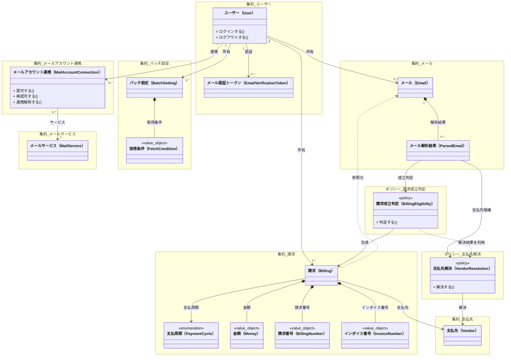
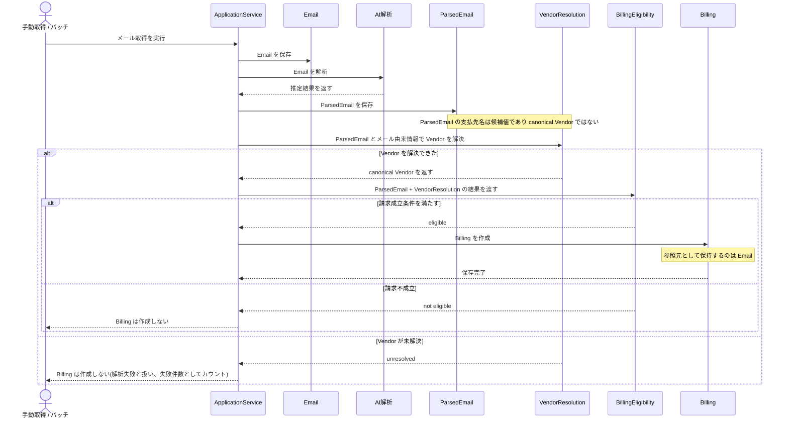

# ドメインモデル

本ドキュメントは、billingrse のドメインモデルを概念レベルでまとめたドキュメントである。
集約境界、主要なエンティティ / 値オブジェクト / ポリシー、関係と依存関係を整理する。

参照:
- `docs/ddd/ubiquitous-language/README.md`
- `docs/ddd/invariants.md`

## クラス図

## 集約境界（概念レベル）

本システムで扱う集約ルートと、どの概念を内包または参照するかを整理する。

## 集約一覧

### ユーザー集約
- ルート: ユーザー（User）
- 含む: メール認証トークン（EmailVerificationToken）
- 説明: データ分離の単位

### メールサービス集約
- ルート: メールサービス（MailService）
- 説明: 参照データの集約

### メールアカウント連携集約
- ルート: メールアカウント連携（MailAccountConnection）
- 参照: ユーザー / メールサービス

### バッチ設定集約
- ルート: バッチ設定（BatchSetting）
- 含む: 取得条件（FetchCondition）
- 所有: ユーザー（User）
- 説明: ユーザーが所有するメール取得設定の集約

### メール集約
- ルート: メール（Email）
- 含む: メール解析結果（ParsedEmail）
- 参照: ユーザー

### 請求集約
- ルート: 請求（Billing）
- 参照: 支払先（Vendor）/ メール（Email）/ 支払周期（PaymentCycle）
- 含む（値オブジェクト）: 金額（Money）/ 請求番号（BillingNumber）/ インボイス番号（InvoiceNumber）

### 支払先集約
- ルート: 支払先（Vendor）
- 説明: 参照データの集約

## 概念モデル

詳細な属性設計や実装方針は別途策定する。

### エンティティ

#### ユーザー（User）
- サービスを利用する主体
- データ分離の単位
- ユーザー名・メールアドレスを持つ
- パスワードハッシュを保持する
- メール認証状態と認証日時を持つ

#### メール認証トークン（EmailVerificationToken）
- ユーザーのメール認証に使うトークン
- 有効期限と消費状態を持つ

#### メールサービス（MailService）
- Gmail / Outlook などのサービス種別

#### メールアカウント連携（MailAccountConnection）
- ユーザーの外部メールサービス接続情報
- 認可情報（アクセストークン / リフレッシュトークン）を持つ

#### バッチ設定（BatchSetting）
- ユーザーが所有するメール取得設定の集約ルート
- 取得条件（FetchCondition）と実行スケジュールを持つ

#### メール（Email）
- 取得したメールを表す
- Billing の参照元として保持される

#### メール解析結果（ParsedEmail）
- Email から生成される推定データ
- Email に紐づく解析履歴として保持される
- 解析結果の各フィールドは推定値のため、厳密な値オブジェクトは持たせない（プリミティブで保持）

#### 支払先（Vendor）
- 正規化された事業者・サービス
- ParsedEmail 上の候補名とは別の canonical な概念

#### 請求（Billing）
- 金額（Money）・支払先・請求番号（BillingNumber）・インボイス番号（InvoiceNumber）などが確定した支払いの事実

### 概念 / ポリシー / 列挙

#### 請求成立判定（BillingEligibility）
- ParsedEmail を入力として成立可否を判断するポリシー
- 永続化されない
- Vendor の正規化そのものは担わず、支払先解決の結果を利用する

#### 支払先解決（VendorResolution）
- ParsedEmail の支払先候補やメール由来の情報をもとに、正規化済み Vendor を決定するポリシー
- BillingEligibility とは別責務である
- 表記揺れや AI 解析結果の揺らぎを吸収する

#### 支払周期（PaymentCycle）
- 請求が単発か定期かを表す分類

#### メール認証（EmailVerification）
- EmailVerificationToken を用いてメールアドレスの正当性を確認する手続き
- 永続化されない

### 値オブジェクト（各集約に内包）

#### 取得条件（FetchCondition）
- メール取得の対象期間とラベルの組
- BatchSetting 集約に内包される
- 期間とラベルは必須

#### 金額（Money）
- 金額と通貨の組
- 金額は小数第3位までを許容する
- 通貨は ISO 4217 の3文字コード
- 当面は JPY / USD のみに限定する

#### 請求番号（BillingNumber）
- ベンダーが発行する請求書の識別子
- 必須

#### インボイス番号（InvoiceNumber）
- 適格請求書発行事業者登録番号
- 形式は "T" + 数字13桁
- 任意（存在しない請求もある）

## 主要な関係（概念）

- ユーザーは複数のメールアカウント連携を持つ
- ユーザーは複数のメール認証トークンを持つ
- ユーザーは複数のバッチ設定を持つ
- メールアカウント連携は1つのメールサービスに紐づく
- BatchSetting は FetchCondition を持つ
- Email は ParsedEmail を保持する
- ParsedEmail は支払先解決の入力になる
- BillingEligibility は ParsedEmail と支払先解決の結果を用いて成立判定する
- Billing は Vendor を参照し、参照元として Email を持つ

## 依存関係（モデル）

- User / MailService / Vendor / PaymentCycle / FetchCondition / Money / BillingNumber / InvoiceNumber は他に依存しない
- MailAccountConnection -> User, MailService
- BatchSetting -> User, FetchCondition
- Email -> User
- ParsedEmail -> Email
- VendorResolution（ポリシー） -> ParsedEmail, Vendor
- BillingEligibility（ポリシー） -> ParsedEmail, VendorResolution の結果
- Billing -> Vendor, PaymentCycle, Money, BillingNumber, InvoiceNumber, Email（参照元）

## 請求生成フロー（シーケンス図）

`VendorResolution` を含む、Email 取得から Billing 作成までの代表的な流れを示す。

## 補足

- 不変条件の詳細は `docs/ddd/invariants.md` を正とする
