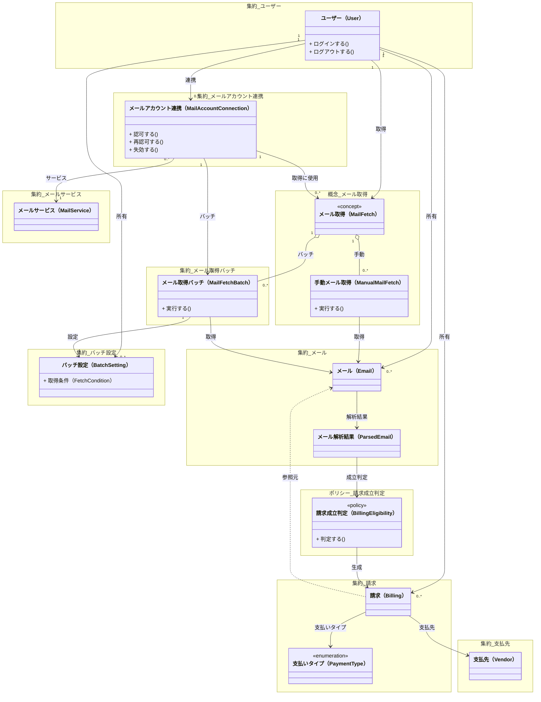

# ドメインモデル クラス図

```mermaid
classDiagram
  namespace 集約_ユーザー {
    class User["ユーザー（User）"] {
      + ログインする()
      + ログアウトする()
    }
  }
  namespace 集約_メールサービス {
    class MailService["メールサービス（MailService）"]
  }
  namespace 集約_メールアカウント連携 {
    class MailAccountConnection["メールアカウント連携（MailAccountConnection）"] {
      + 認可する()
      + 再認可する()
      + 失効する()
    }
  }
  namespace 集約_メール取得バッチ {
    class MailFetchBatch["メール取得バッチ（MailFetchBatch）"] {
      + 実行する()
    }
  }
  namespace 集約_バッチ設定 {
    class BatchSetting["バッチ設定（BatchSetting）"] {
      + 取得条件（FetchCondition）
    }
  }
  namespace 概念_メール取得 {
    class MailFetch["メール取得（MailFetch）"]
    class ManualMailFetch["手動メール取得（ManualMailFetch）"] {
      + 実行する()
    }
  }
  namespace 集約_メール {
    class Email["メール（Email）"]
    class ParsedEmail["メール解析結果（ParsedEmail）"]
  }
  namespace ポリシー_請求成立判定 {
    class BillingEligibility["請求成立判定（BillingEligibility）"] {
      + 判定する()
    }
  }
  namespace 集約_請求 {
    class Billing["請求（Billing）"]
    class PaymentType["支払いタイプ（PaymentType）"]
  }
  namespace 集約_支払先 {
    class Vendor["支払先（Vendor）"]
  }

  <<concept>> MailFetch
  <<policy>> BillingEligibility
  <<enumeration>> PaymentType

  User "1" --> "0..*" MailAccountConnection : 連携
  User "1" --> "0..*" MailFetch : 取得
  User "1" --> "0..*" BatchSetting : 所有
  User "1" --> "0..*" Email : 所有
  User "1" --> "0..*" Billing : 所有

  MailAccountConnection "0..*" --> "1" MailService : サービス
  MailAccountConnection "1" --> "0..*" MailFetch : 取得に使用
  MailAccountConnection "1" --> "0..*" MailFetchBatch : バッチ

  MailFetch "1" o-- "0..*" ManualMailFetch : 手動
  MailFetch "1" o-- "0..*" MailFetchBatch : バッチ

  MailFetchBatch "1" --> "1" BatchSetting : 設定

  ManualMailFetch --> Email : 取得
  MailFetchBatch --> Email : 取得

  Email --> ParsedEmail : 解析結果
  ParsedEmail --> BillingEligibility : 成立判定
  BillingEligibility --> Billing : 生成

  Billing --> Vendor : 支払先
  Billing --> PaymentType : 支払いタイプ
  Billing ..> Email : 参照元
```
