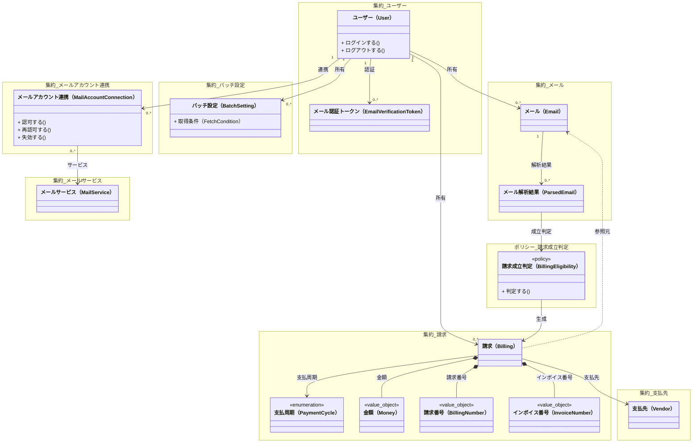

# ドメインモデル クラス図

# 集約境界（概念レベル）

本ドキュメントは、ドメインモデルの集約境界を概念レベルで整理する。

参照:
- `docs/ddd/ubiquitous-language/README.md`
- `docs/ddd/invariants.md`
- `docs/ddd/domain-model.md`

## 集約一覧

### ユーザー集約
- ルート: ユーザー（User）
- 含む: メール認証トークン（EmailVerificationToken）
- 説明: データ分離の単位

### メールサービス集約
- ルート: メールサービス（MailService）
- 説明: 参照データの集約

### メールアカウント連携集約
- ルート: メールアカウント連携（MailAccountConnection）
- バッチ設定: 取得条件 / 実行スケジュール（いずれも連携に紐づく）
- 参照: ユーザー / メールサービス

### メール集約
- ルート: メール（Email）
- 含む: メール解析結果（ParsedEmail）
- 参照: ユーザー

### 請求集約
- ルート: 請求（Billing）
- 参照: 支払先（Vendor）/ メール（Email）/ 支払周期（PaymentCycle）
- 含む（値オブジェクト）: 金額（Money）/ 請求番号（BillingNumber）/ インボイス番号（InvoiceNumber）

### 支払先集約
- ルート: 支払先（Vendor）
- 説明: 参照データの集約

## 補足

- 不変条件の詳細は `docs/ddd/invariants.md` を正とする
