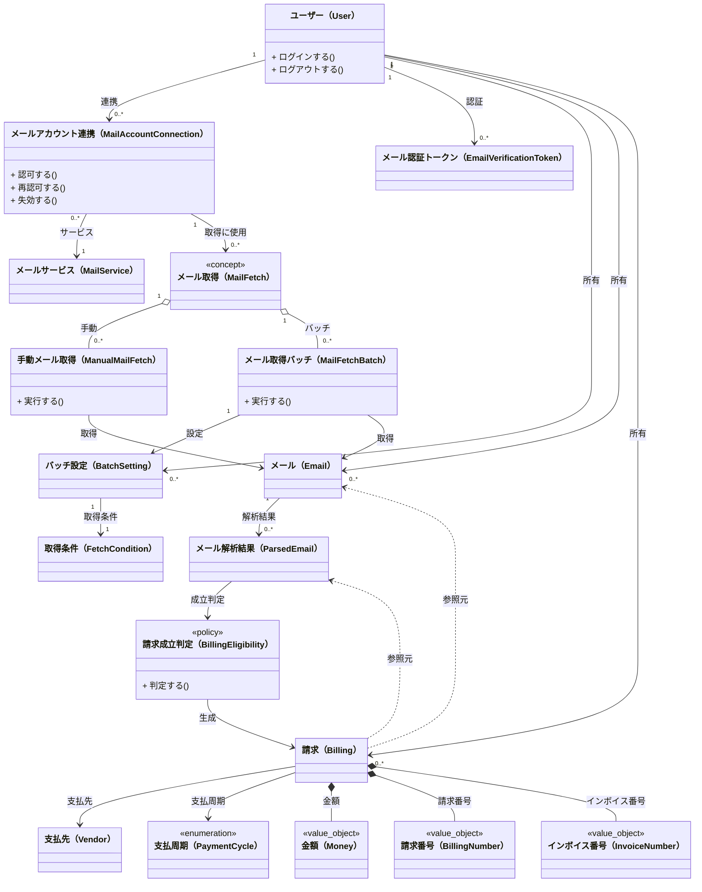

# Ubiquitous Language Class Diagram

```mermaid
classDiagram
  class User["ユーザー（User）"]
  class EmailVerificationToken["メール認証トークン（EmailVerificationToken）"]
  class MailService["メールサービス（MailService）"]
  class MailAccountConnection["メールアカウント連携（MailAccountConnection）"]
  class MailFetch["メール取得（MailFetch）"]
  class ManualMailFetch["手動メール取得（ManualMailFetch）"]
  class MailFetchBatch["メール取得バッチ（MailFetchBatch）"]
  class BatchSetting["バッチ設定（BatchSetting）"]
  class FetchCondition["取得条件（FetchCondition）"]
  class Email["メール（Email）"]
  class ParsedEmail["メール解析結果（ParsedEmail）"]
  class BillingEligibility["請求成立判定（BillingEligibility）"]
  class Billing["請求（Billing）"]
  class Vendor["支払先（Vendor）"]
  class PaymentCycle["支払周期（PaymentCycle）"]
  class Money["金額（Money）"]
  class BillingNumber["請求番号（BillingNumber）"]
  class InvoiceNumber["インボイス番号（InvoiceNumber）"]

  class User {
    + ログインする()
    + ログアウトする()
  }

  class MailAccountConnection {
    + 認可する()
    + 再認可する()
    + 失効する()
  }

  class ManualMailFetch {
    + 実行する()
  }

  class MailFetchBatch {
    + 実行する()
  }

  class BillingEligibility {
    + 判定する()
  }

  <<concept>> MailFetch
  <<policy>> BillingEligibility
  <<enumeration>> PaymentCycle
  <<value_object>> Money
  <<value_object>> BillingNumber
  <<value_object>> InvoiceNumber

  User "1" --> "0..*" MailAccountConnection : 連携
  User "1" --> "0..*" EmailVerificationToken : 認証
  User "1" --> "0..*" BatchSetting : 所有
  User "1" --> "0..*" Email : 所有
  User "1" --> "0..*" Billing : 所有

  MailAccountConnection "0..*" --> "1" MailService : サービス
  MailAccountConnection "1" --> "0..*" MailFetch : 取得に使用

  MailFetch "1" o-- "0..*" ManualMailFetch : 手動
  MailFetch "1" o-- "0..*" MailFetchBatch : バッチ

  MailFetchBatch "1" --> "1" BatchSetting : 設定
  BatchSetting "1" --> "1" FetchCondition : 取得条件

  ManualMailFetch --> Email : 取得
  MailFetchBatch --> Email : 取得

  Email "1" --> "0..*" ParsedEmail : 解析結果
  ParsedEmail --> BillingEligibility : 成立判定
  BillingEligibility --> Billing : 生成

  Billing --> Vendor : 支払先
  Billing --> PaymentCycle : 支払周期
  Billing *-- Money : 金額
  Billing *-- BillingNumber : 請求番号
  Billing *-- InvoiceNumber : インボイス番号
  Billing ..> Email : 参照元
  Billing ..> ParsedEmail : 参照元
```
