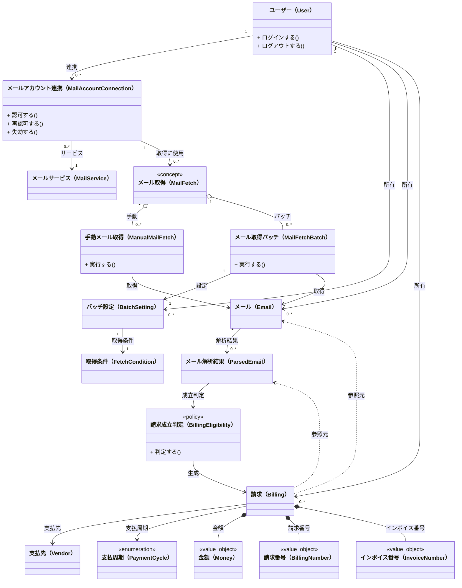

# ユビキタス言語

- 以下は設計・実装・会話で共通に使う言葉
- 事実／判断／仮説が混ざらないように整理済み


# Ubiquitous Language Class Diagram



## カテゴリ別ファイル

| カテゴリ名 | 言語 |
| --- | --- |
| [ユーザー系](user.md) | ユーザー（User）,ログイン（Login）,ログアウト（Logout）,ユーザー名（UserName）,メールアドレス（EmailAddress）,パスワード（Password）,パスワードハッシュ（PasswordHash）,メール認証（EmailVerification）,メール認証トークン（EmailVerificationToken） |
| [メール連携/取得系](mail-integration-fetch.md) | メールサービス（MailService）,メールアカウント連携（MailAccountConnection）,メール取得（MailFetch）,手動メール取得（ManualMailFetch）,メール取得バッチ（MailFetchBatch）,バッチ設定（BatchSetting）,取得条件（FetchCondition） |
| [メール/解析系](mail-analysis.md) | メール（Email）,メール解析結果（ParsedEmail）,請求成立判定（BillingEligibility） |
| [請求/支払先系](billing-vendor.md) | 支払先（Vendor）,請求（Billing）,支払周期（PaymentCycle）,金額（Money）,請求番号（BillingNumber）,インボイス番号（InvoiceNumber） |

## 用語間の関係（言語レベル）

```
ユーザー
  ↓ 連携
メールアカウント連携
  ↓
メール取得（手動メール取得/メール取得バッチ）
  ↓
メール
  ↓ 解析
メール解析結果
  ↓ 請求成立判定
請求
  └─ 支払先

メールサービス
  ↓ 連携
メールアカウント連携
  ↓
メール取得（手動メール取得/メール取得バッチ）
  ↓
メール
  ↓ 解析
メール解析結果
  ↓ 請求成立判定
請求
  └─ 支払先
```

## 意図的に未定義としている言葉

注記: 今は使わない（将来のサブドメイン）

- 支出
- 家計簿
- 会計
- 月次集計
- 合計金額
