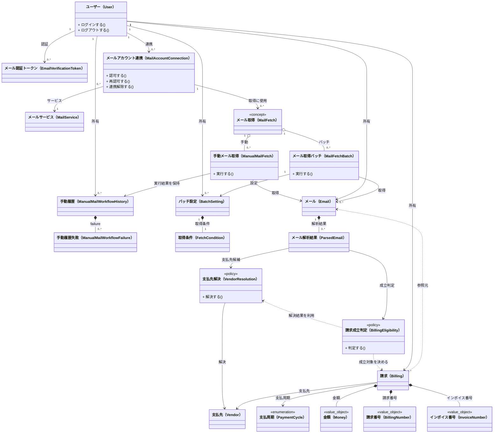

# ユビキタス言語

- 以下は設計・実装・会話で共通に使う言葉
- 事実／判断／仮説が混ざらないように整理済み


## クラス図


```mermaid
classDiagram
  class User["ユーザー（User）"]
  class EmailVerificationToken["メール認証トークン（EmailVerificationToken）"]
  class MailService["メールサービス（MailService）"]
  class MailAccountConnection["メールアカウント連携（MailAccountConnection）"]
  class MailFetch["メール取得（MailFetch）"]
  class ManualMailFetch["手動メール取得（ManualMailFetch）"]
  class ManualMailWorkflowHistory["手動履歴（ManualMailWorkflowHistory）"]
  class ManualMailWorkflowFailure["手動履歴失敗（ManualMailWorkflowFailure）"]
  class MailFetchBatch["メール取得バッチ（MailFetchBatch）"]
  class BatchSetting["バッチ設定（BatchSetting）"]
  class FetchCondition["取得条件（FetchCondition）"]
  class Email["メール（Email）"]
  class ParsedEmail["メール解析結果（ParsedEmail）"]
  class VendorResolution["支払先解決（VendorResolution）"]
  class BillingEligibility["請求成立判定（BillingEligibility）"]
  class Billing["請求（Billing）"]
  class Vendor["支払先（Vendor）"]
  class PaymentCycle["支払周期（PaymentCycle）"]
  class Money["金額（Money）"]
  class BillingNumber["請求番号（BillingNumber）"]
  class InvoiceNumber["インボイス番号（InvoiceNumber）"]

  class User {
    + ログインする()
    + ログアウトする()
  }

  class MailAccountConnection {
    + 認可する()
    + 再認可する()
    + 連携解除する()
  }

  class ManualMailFetch {
    + 実行する()
  }

  class MailFetchBatch {
    + 実行する()
  }

  class BillingEligibility {
    + 判定する()
  }

  class VendorResolution {
    + 解決する()
  }

  <<policy>> VendorResolution
  <<concept>> MailFetch
  <<policy>> BillingEligibility
  <<enumeration>> PaymentCycle
  <<value_object>> Money
  <<value_object>> BillingNumber
  <<value_object>> InvoiceNumber

  User "1" --> "0..*" MailAccountConnection : 連携
  MailAccountConnection "1" --> "0..*" MailFetch : 取得に使用
  MailFetch "1" o-- "0..*" ManualMailFetch : 手動
  ManualMailFetch --> Email : 取得
  Email "1" *-- "0..*" ParsedEmail : 解析結果
  ParsedEmail --> VendorResolution : 支払先候補
  VendorResolution <.. BillingEligibility : 解決結果を利用
  BillingEligibility ..> Billing : 成立対象を決める

  User "1" --> "0..*" EmailVerificationToken : 認証
  User "1" --> "0..*" BatchSetting : 所有
  User "1" --> "0..*" ManualMailWorkflowHistory : 所有
  User "1" --> "0..*" Email : 所有
  User "1" --> "0..*" Billing : 所有

  MailAccountConnection "0..*" --> "1" MailService : サービス

  MailFetch "1" o-- "0..*" MailFetchBatch : バッチ
  MailFetchBatch "1" --> "1" BatchSetting : 設定
  BatchSetting "1" *-- "1" FetchCondition : 取得条件
  MailFetchBatch --> Email : 取得

  ManualMailFetch --> ManualMailWorkflowHistory : 実行結果を保持
  ManualMailWorkflowHistory *-- "0..*" ManualMailWorkflowFailure : failure

  ParsedEmail --> BillingEligibility : 成立判定
  VendorResolution --> Vendor : 解決

  Billing --> Vendor : 支払先
  Billing --> PaymentCycle : 支払周期
  Billing *-- Money : 金額
  Billing *-- BillingNumber : 請求番号
  Billing *-- InvoiceNumber : インボイス番号
  Billing ..> Email : 参照元
```

## カテゴリ別ファイル

| カテゴリ名 | 言語 |
| --- | --- |
| [ユーザー系](user.md) | ユーザー（User）,ログイン（Login）,ログアウト（Logout）,ユーザー名（UserName）,メールアドレス（EmailAddress）,パスワード（Password）,パスワードハッシュ（PasswordHash）,メール認証（EmailVerification）,メール認証トークン（EmailVerificationToken） |
| [メール連携/取得系](mail-integration-fetch.md) | メールサービス（MailService）,メールアカウント連携（MailAccountConnection）,メール取得（MailFetch）,手動メール取得（ManualMailFetch）,手動メール取得条件（ManualMailFetchCondition）,手動履歴（ManualMailWorkflowHistory）,手動履歴失敗（ManualMailWorkflowFailure）,メール取得バッチ（MailFetchBatch）,バッチ設定（BatchSetting）,取得条件（FetchCondition） |
| [メール/解析系](mail-analysis.md) | メール（Email）,メール解析結果（ParsedEmail）,請求成立判定（BillingEligibility） |
| [請求/支払先系](billing-vendor.md) | 支払先（Vendor）,支払先解決（VendorResolution）,請求（Billing）,支払周期（PaymentCycle）,金額（Money）,請求番号（BillingNumber）,インボイス番号（InvoiceNumber） |

## 用語間の関係（言語レベル）

```
ユーザー
  ├─ 認証
  │   └─ メール認証トークン
  ├─ 連携
  │   └─ メールアカウント連携
  │       └─ メールサービス
  ├─ 所有
  │   └─ バッチ設定
  │       └─ 取得条件
  ├─ 所有
  │   └─ 手動履歴
  │       ├─ 手動メール取得条件
  │       └─ 手動履歴失敗
  ├─ 所有
  │   └─ メール
  │       └─ メール解析結果
  └─ 所有
      └─ 請求
          └─ 支払先

メール解析結果
  ↓ 支払先解決
支払先

メール解析結果
  ↓ 請求成立判定
請求
  └─ 参照元として Email を持つ

請求成立判定
  └─ 支払先解決の結果を利用する

手動メール取得
  └─ 実行結果として 手動履歴 を持つ

手動履歴
  ├─ 受付時点の手動メール取得条件 を持つ
  └─ failure として 手動履歴失敗 を持つ
```

## 意図的に未定義としている言葉

注記: 今は使わない（将来のサブドメイン）

- 支出
- 家計簿
- 会計
- 月次集計
- 合計金額
