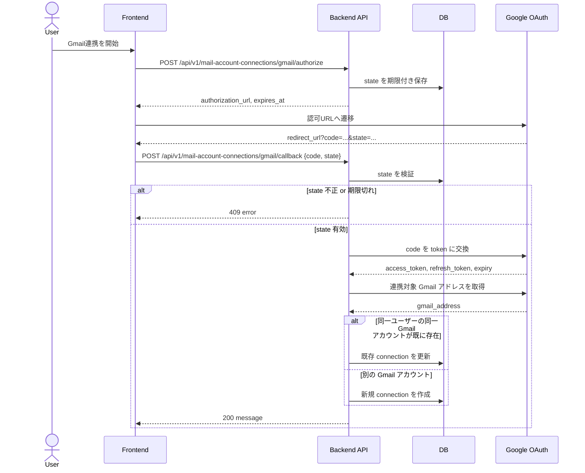

# Gmail OAuth 連携 API 要件定義

## シーケンス図



## 背景
- ユーザーが Gmail OAuth を通じて `MailAccountConnection` を作成できるようにしたい。
- 現行コードには以下の断片が存在する。
- `internal/common/domain/mail_account_connection.go`
- `internal/library/gmailService/oauth_config_loader.go`
- `tools/migrations/models/email_credential.go`
- ただし `internal/emailcredential` 相当の application / infrastructure / presentation 実装は未作成で、HTTP API も未実装。

## 現状把握
- HTTP API は Gin + Clean Architecture + dig DI 構成。
- JWT 認証済み API は `AuthMiddleware` により `userID` を request context / Gin context に載せる。
- Google の redirect は frontend で受け、backend には `code` と `state` を JSON body で渡す前提とする。
- Gmail OAuth の client_id / client_secret / redirect_url は環境変数で取得できる。
- Gmail スコープは当面 `gmail.readonly` のみとする。
- `email_credentials` テーブルには以下があり、Gmail OAuth の pending state と token 保存を担える構造になっている。
- `user_id`, `type`
- `access_token`, `access_token_digest`
- `refresh_token`, `refresh_token_digest`
- `token_expiry`
- `o_auth_state`, `o_auth_state_expires_at`
- 現行の `email_credentials` は `user_id + type` で一意制約を持つが、今回はこれを修正し、同一ユーザーが複数 Gmail アカウントを連携できる前提とする。

## 目的
- 認証済みユーザー向けに Gmail 連携開始 API を提供する。
- Google から返った `code` と `state` を backend API で受け、トークン交換して保存する。
- 保存完了後、ユーザーの Gmail `MailAccountConnection` が作成済みであることを backend が表現できるようにする。
- 1ユーザーが複数の Gmail アカウントを連携できるようにする。

## スコープ
- Gmail OAuth 認可 URL 発行 API
- Gmail OAuth コールバック受け付け API
- OAuth state の保存 / 検証
- access_token / refresh_token の暗号化保存
- 連携対象 Gmail アカウント識別子の取得
- 既存ユーザーに対する Gmail 連携の作成または再連携
- Controller / UseCase / Repository / DI / Router / テスト追加

## 非スコープ
- Gmail メール取得処理そのもの
- バッチ設定
- 複数メールサービス対応
- Gmail 連携解除 API
- フロントエンド画面実装

## 想定ユースケース
1. ログイン済みユーザーが Gmail 連携開始 API を叩く。
2. backend は OAuth state を生成し、期限付きで保存する。
3. backend は Google 認可 URL を返す。
4. frontend はその URL へ遷移させる。
5. Google は `EMAIL_GMAIL_REDIRECT_URL` に `code` と `state` を付けて返す。
6. frontend は `code` と `state` を backend API に JSON body で送る。
7. backend は state を検証し、Google と token exchange を行う。
8. backend は連携対象の Gmail アドレスを取得する。
9. backend は token を暗号化・digest 化して保存する。
10. 同一ユーザーが別の Gmail アカウントを連携する場合は別 connection として保存する。
11. 同一ユーザーが同じ Gmail アカウントを再連携する場合は既存 connection を更新する。
12. backend は Gmail 連携完了レスポンスを返す。

## 機能要件
- 認可 URL 発行 API は認証必須。
- 認可 URL 発行 API は Gmail 用 OAuth config を使って URL を生成する。
- state は十分にランダムであること。
- state には有効期限を持たせること。
- コールバック API は認証必須。
- コールバック API は body から `code` と `state` を受け取ること。
- state 不一致または期限切れでは保存しないこと。
- token exchange 成功後に、連携対象 Gmail アドレスを取得すること。
- 1ユーザーは複数の Gmail `MailAccountConnection` を持てること。
- 同一ユーザー内で別 Gmail アカウントを連携した場合は別 connection を作成すること。
- 同一ユーザー内で同じ Gmail アカウントを再連携した場合は既存 connection を更新すること。
- connection の同一性は `user + provider + gmail_address` で判定すること。
- token は平文保存せず、既存の `crypto.Vault` を利用して暗号化すること。
- digest も保存すること。
- provider 種別は当面 `gmail` 固定とすること。
- Gmail スコープは `gmail.readonly` のみとすること。

## 非機能要件
- トークンは API レスポンスに含めない。
- 構造化ログを残すが、access_token / refresh_token / auth code はログ出力しない。
- HTTP DTO は `lower_snake_case` に統一する。
- エラーレスポンスは `docs/api_design.md` の標準形式に従う。

## API 案

### 1. Gmail 認可 URL 発行
- Method: `POST`
- Path: `/api/v1/mail-account-connections/gmail/authorize`
- Auth: required
- Request body: なし
- Response 200:

```json
{
  "authorization_url": "https://accounts.google.com/o/oauth2/auth?...",
  "expires_at": "2026-03-19T12:34:56Z"
}
```

### 2. Gmail OAuth コールバック受け付け
- Method: `POST`
- Path: `/api/v1/mail-account-connections/gmail/callback`
- Auth: required
- Request body:

```json
{
  "code": "google_auth_code",
  "state": "opaque_random_state"
}
```

- Response 200:

```json
{
  "message": "Gmail連携が完了しました。"
}
```

## エラー案
- `400 invalid_request`: body 不正、`code`/`state` 欠落
- `401 unauthorized`: JWT 不正
- `409 oauth_state_mismatch`: state 不一致
- `409 oauth_state_expired`: state 期限切れ
- `409 mail_account_connection_conflict`: 同一性判定上の競合
- `503 gmail_oauth_exchange_failed`: Google token exchange 失敗
- `500 internal_server_error`: 想定外エラー

## 設計メモ
- `MailAccountConnection` は DDD 上の公開概念としつつ、実装は `email_credentials` テーブルを backing store として扱う想定。
- pending state 保存時点では token 未取得のため、`internal/common/domain.MailAccountConnection` をそのまま pending record に使うのは不自然。
- そのため internal package は `emailcredential` もしくは同等責務の package として切り出し、OAuth 途中状態と接続済み状態の両方を扱えるモデルを持つのが自然。
- 複数 Gmail 連携要件に合わせ、現行の `email_credentials(user_id, type)` 一意制約は修正対象とする。
- 同一 connection 判定に使う Gmail アドレスを保存できるようにする必要がある。

## 成功条件
- 認証済みユーザーが Gmail 認可 URL を取得できる。
- 返却された `code` / `state` を backend に渡すと token が保存される。
- 同一ユーザーで 3 つ以上の Gmail アカウントを連携できる。
- 同一ユーザーで同じ Gmail アカウントを再連携した場合に重複レコードではなく更新になる。
- controller / usecase / repository の単体テストが追加される。
- router にエンドポイントが追加される。

## 確定事項
- 同一 Gmail アカウント判定は Gmail アドレスを第一候補とする。
- `email_credentials(user_id, type)` 一意制約は修正し、複数 Gmail 連携を正とする。
