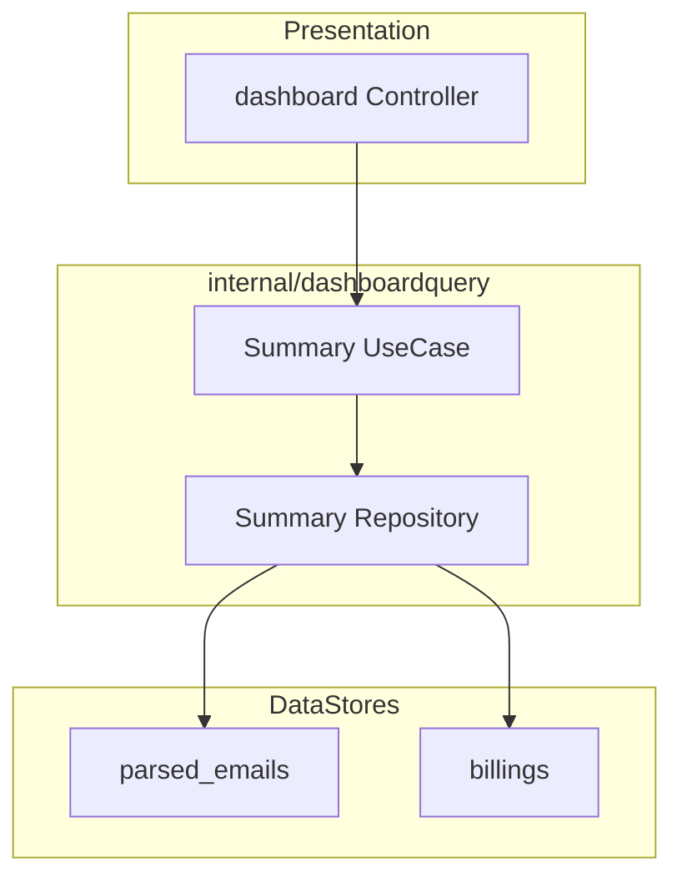

# Dashboard Summary API 設計

## 本書の位置づけ

- 本書は `Dashboard Summary API` の基本設計をまとめる。
- 要件定義は [requirementsDefinition.md](./requirementsDefinition.md) を参照する。
- 本書では責務分割、API 契約、集計方針までを扱い、実装レベルの詳細は含めない。

## 設計方針

- `Dashboard Summary API` はダッシュボード初期表示専用の read API とする。
- 3 指標は `parsed_emails` と `billings` にまたがるため、既存 `billings/summary` とは分離する。
- 集計は domain で扱わず、repository で SQL 集計する。
- application は「現在月の境界決定」と「複数集計結果の取りまとめ」に責務を限定する。
- レスポンスは KPI 3 項目のみとし、内訳や推移は含めない。

## 全体構成



## API 契約

### Endpoint
- Method: `GET`
- Path: `/api/v1/dashboard/summary`
- Auth: required

### Query
- v1 では query parameter を持たない

### Response 200
```json
{
  "current_month_analysis_success_count": 1280,
  "total_saved_billing_count": 842,
  "fallback_billing_count": 73
}
```

### Error
- `401 unauthorized`
  - JWT 不正または未認証
- `500 internal_server_error`
  - 集計取得の内部失敗

## 責務分割

| 対象 | 役割 | やらないこと |
| --- | --- | --- |
| `internal/app/presentation/dashboard` | HTTP 入力の受け取り、認証済み user の引き渡し、response への変換 | SQL 集計、月境界計算、domain 判定 |
| `internal/dashboardquery/application` | UTC 現在月の境界決定、repository 呼び出し、KPI の取りまとめ | HTTP 依存、DB 直接操作 |
| `internal/dashboardquery/infrastructure` | `parsed_emails` / `billings` を SQL 集計して返す | HTTP 依存、業務 aggregate の意味変更 |
| `internal/common/domain` など既存 domain | 既存 aggregate / value object の保持 | dashboard KPI の新規業務概念化 |

## 指標ごとの取得方針

### `current_month_analysis_success_count`
- 集計元は `parsed_emails` とする。
- 月判定は v1 では UTC 現在月を使う。
- application で「当月 UTC 月初」と「翌月 UTC 月初」を求め、その範囲で repository が件数集計する。
- workflow 履歴の `analysis_success_count` 合算は使わない。

### `total_saved_billing_count`
- 集計元は `billings` とする。
- 重複判定で保存されなかったものは含めない。
- repository が保存済み請求件数を集計する。

### `fallback_billing_count`
- 集計元は `billings` とする。
- 判定条件は `billing_date IS NULL` とする。
- 既存 `fallback_billing_count` の意味と揃える。

## SQL 集計方針

- 件数集計は repository の SQL で行う。
- domain に件数ロジックを持ち込まない。
- 全件ロードして application で数える方式は採らない。
- クエリ本数は固定とし、N+1 を起こさない。

補足:
- `current_month_analysis_success_count` は期間条件付き `COUNT(*)`
- `total_saved_billing_count` は `billings` の `COUNT(*)`
- `fallback_billing_count` は `billings.billing_date IS NULL` 条件付き `COUNT(*)`

## package 構成

```text
internal/
  app/
    presentation/
      dashboard/
    router/
  dashboardquery/
    application/
    infrastructure/
  di/
```

## 基本設計上の判断

- dashboard KPI は画面専用 read model として追加し、既存 aggregate の意味を変更しない。
- 集計の正本は既存永続化データとし、workflow 履歴を現在値 API の集計元にはしない。
- `billings` 由来の 2 指標について、「実件数と一致」は定義上の意味であり、別の同期処理や検証処理を追加する要求ではない。
- 将来 KPI が増えても、同じ read API 内で追加できる余地を残す。

## テスト観点

### Controller
- 200 正常系
- 401 unauthorized
- 500 internal_server_error

### UseCase
- UTC 月境界の既定値適用
- データなし時に `0` を返す

### Repository
- `user_id` 所有範囲
- `parsed_emails` 当月件数集計
- `billings` 総件数集計
- `billings.billing_date IS NULL` 件数集計
