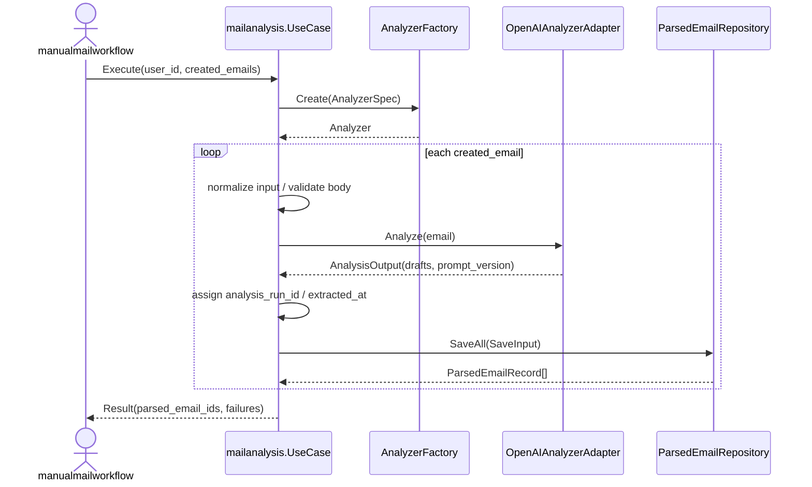

# internal/mailanalysis 設計

## 1. 設計方針

- `internal/mailanalysis` は `manualmailworkflow` 配下の 1 stage として扱う。
- 入力は `mailfetch` が返す `created_emails` を正とし、通常経路では `Email` の再読込を前提にしない。
- 責務は「解析対象組み立て」「prompt 生成」「AI 呼び出し」「応答の構造化」「ParsedEmail 保存」に限定する。
- 外部メールサービスからの取得、canonical Vendor の解決、`Billing` 生成、下流 stage の起動は持たない。
- `ParsedEmail.ExtractedAt` は LLM 出力ではなく、application 層がシステム時刻で付与する。
- `internal/library/openai` は OpenAI SDK の薄いラッパーに留め、`ParsedEmail` への変換は `mailanalysis` 側 adapter で行う。
- `created_emails` に含まれる本文は同一 workflow 内の一時 payload として扱い、`Email` 本体の永続化要件には含めない。

## 2. package 構成

### `internal/mailanalysis/application`

- `UseCase`
- `Command`, `Result`
- `EmailForAnalysisTarget`
- port interface
- 解析実行と保存オーケストレーション

### `internal/mailanalysis/domain`

- `AnalysisOutput`
- `ParsedEmailRecord`
- `SaveInput`
- `MessageFailure`
- domain error

補足:
- `ParsedEmail` の billing 可否はここで判定しない。
- `ExtractedAt`、`analysis_run_id`、`prompt_version` などの保存 metadata は domain に明示する。

### `internal/mailanalysis/infrastructure`

- `DefaultAnalyzerFactory`
- `OpenAIAnalyzerAdapter`
- prompt builder
- `GormParsedEmailRepositoryAdapter`

## 3. UseCase 契約

```go
type Command struct {
	UserID uint
	Emails []EmailForAnalysisTarget
}

type Result struct {
	ParsedEmailIDs     []uint
	AnalyzedEmailCount int
	ParsedEmailCount   int
	Failures           []domain.MessageFailure
}

type UseCase interface {
	Execute(ctx context.Context, cmd Command) (Result, error)
}
```

補足:
- `Emails` は `manualmailworkflow` が `mailfetch.CreatedEmails` を変換して渡す。
- `ParsedEmailIDs` は保存済み `ParsedEmail` の ID 一覧であり、`billing` stage への入力に使う。
- `Failures` は email 単位の部分失敗を表す。
- analyzer 初期化失敗や repository 障害のような stage 全体失敗は `error` で返す。

## 4. domain 設計

### `EmailForAnalysisTarget`

```go
type EmailForAnalysisTarget struct {
	EmailID           uint
	ExternalMessageID string
	Subject           string
	From              string
	To                []string
	ReceivedAt        time.Time
	Body              string
}
```

役割:
- `mailfetch` から受け取る本文付き payload を `mailanalysis` の入力境界として固定する。
- `Email` aggregate そのものとは分け、workflow 境界の DTO として扱う。

ルール:
- `EmailID` は必須
- `ExternalMessageID` は必須
- `Body` は空文字を許容しない

### `ParsedEmail`

```go
type ParsedEmail struct {
	ProductNameRaw     *string
	ProductNameDisplay *string
	VendorName         *string
	BillingNumber      *string
	InvoiceNumber      *string
	Amount             *float64
	Currency           *string
	BillingDate        *time.Time
	PaymentCycle       *string
}
```

役割:
- AI 応答を受ける推定結果モデル
- `ExtractedAt` は analyzer では付与せず、保存時にシステム側で設定する

ルール:
- 推定結果なので必須項目の充足は要求しない
- 空文字は normalize で `nil` に寄せる
- `Currency` は存在する場合のみ大文字化する
- `PaymentCycle` は存在する場合のみ lower snake_case に寄せる

### `AnalysisOutput`

```go
type AnalysisOutput struct {
	ParsedEmails  []ParsedEmail
	PromptVersion string
}
```

役割:
- analyzer から application へ返す解析結果
- prompt version を同時に返す

### `SaveInput`

```go
type SaveInput struct {
	UserID        uint
	EmailID       uint
	AnalysisRunID string
	PositionBase  int
	ExtractedAt   time.Time
	PromptVersion string
	ParsedEmails  []ParsedEmail
}
```

ルール:
- 1 email + 1 analyzer 呼び出し = 1 `AnalysisRunID`
- `ExtractedAt` は application 層が `clock.Now().UTC()` で設定する
- `PositionBase` は通常 `0` 開始でよい

### `ParsedEmailRecord`

```go
type ParsedEmailRecord struct {
	ID      uint
	EmailID uint
}
```

### `MessageFailure`

```go
type MessageFailure struct {
	EmailID           uint
	ExternalMessageID string
	Stage             string
	Code              string
}
```

`Stage` 例:
- `normalize_input`
- `analyze`
- `response_parse`
- `save`

`Code` 例:
- `invalid_email_input`
- `analysis_failed`
- `analysis_response_invalid`
- `analysis_response_empty`
- `parsed_email_save_failed`

## 5. port 設計

### application port

```go
type AnalyzerSpec struct {
	UserID uint
}

type AnalyzerFactory interface {
	Create(ctx context.Context, spec AnalyzerSpec) (Analyzer, error)
}

type Analyzer interface {
	Analyze(ctx context.Context, email EmailForAnalysisTarget) (domain.AnalysisOutput, error)
}

type ParsedEmailRepository interface {
	SaveAll(ctx context.Context, input domain.SaveInput) ([]domain.ParsedEmailRecord, error)
}
```

設計意図:
- `Analyzer` は AI 呼び出しと応答構造化だけを責務とし、保存しない。
- `ParsedEmailRepository` は `ParsedEmail` の履歴保存に限定する。
- 現在の `created_emails` ベース設計では `EmailRepository` の再読込 port は不要とする。
  - 将来、再解析 API を別経路で提供する場合に追加で検討する。

## 6. OpenAI adapter 境界

### 方針

- `internal/library/openai` は OpenAI SDK 呼び出しとレートリミット/リトライの責務に限定する。
- `internal/library/openai` が `[]ParsedEmail` を直接返す設計は採用しない。
- `OpenAIAnalyzerAdapter` が prompt を生成し、OpenAI 応答 JSON を `[]ParsedEmail` へ変換する。

### 期待する client interface

```go
type Client interface {
	Chat(ctx context.Context, prompt string) (string, error)
}
```

補足:
- `Chat` の戻り値は JSON 文字列または同等の raw payload とする。
- domain へのマッピングは library 層ではなく adapter 層で行う。

## 7. prompt / 応答ルール

### prompt 入力

- `Subject`
- `From`
- `ReceivedAt`
- `Body`

補足:
- `To` は初期実装では prompt に必須としないが、vendor 解決精度の改善が必要になれば追加できる。

### OpenAI 応答

- JSON オブジェクトのみ
- トップレベルキーは `parsedEmails`
- `parsedEmails` は配列
- 各要素のキーは `productNameRaw`, `productNameDisplay`, `vendorName`, `billingNumber`, `invoiceNumber`, `amount`, `currency`, `billingDate`, `paymentCycle`
- 不明値は `null`
- `billingDate` は RFC3339 文字列または `null`
- `extractedAt` は出力させない

### `ExtractedAt` の扱い

- `ExtractedAt` は ParsedEmail 保存時のシステム付与 metadata とする
- 同一 email の 1 回の解析で保存される `ParsedEmail` 群には同じ `ExtractedAt` を設定する

## 8. 永続化設計

### 保存テーブル

想定テーブル: `parsed_emails`

| カラム | 型 | 必須 | 説明 |
| --- | --- | --- | --- |
| `id` | bigint | yes | PK |
| `user_id` | bigint | yes | 所有ユーザー |
| `email_id` | bigint | yes | 参照元 `emails.id` |
| `analysis_run_id` | char(36) | yes | 1 回の解析呼び出し単位 |
| `position` | int | yes | 応答配列内の順序 |
| `product_name_raw` | text | no | 商品名/サービス名の全文候補 |
| `product_name_display` | varchar(255) | no | 表示用の商品名/セット名候補 |
| `vendor_name` | text | no | 支払先候補名 |
| `billing_number` | varchar(255) | no | 請求番号候補 |
| `invoice_number` | varchar(14) | no | インボイス番号候補 |
| `amount` | decimal(18,3) | no | 推定金額 |
| `currency` | char(3) | no | 推定通貨 |
| `billing_date` | datetime | no | 推定請求日 |
| `payment_cycle` | varchar(32) | no | 推定支払周期 |
| `extracted_at` | datetime | yes | システム付与抽出時刻 |
| `prompt_version` | varchar(50) | yes | prompt バージョン |
| `created_at` | datetime | yes | 作成時刻 |
| `updated_at` | datetime | yes | 更新時刻 |

### index / 制約

- `INDEX idx_parsed_emails_user_email (user_id, email_id)`
- `INDEX idx_parsed_emails_analysis_run (analysis_run_id)`
- `UNIQUE KEY uni_parsed_emails_run_position (analysis_run_id, position)`

### 保存方針

- append-only を前提にし、upsert はしない
- 解析結果の再実行は新しい `analysis_run_id` で保存する
- 1 email に対して draft が 0 件なら insert は行わず、`analysis_response_empty` failure を返す

## 9. 実行フロー



## 10. UseCase 詳細

1. `Command` を検証する。
2. `Emails` が空なら即時に空結果を返す。
3. `AnalyzerFactory.Create` を 1 回呼び、利用 analyzer を確定する。
4. 各 `EmailForAnalysisTarget` について入力を normalize する。
5. 入力不正なら `normalize_input` failure を積み、次の email へ進む。
6. `Analyzer.Analyze` を呼び、`ParsedEmail` 群を受け取る。
7. 応答 JSON 不正なら `response_parse` failure を積み、次の email へ進む。
8. draft が 0 件なら `analysis_response_empty` failure を積み、次の email へ進む。
9. `analysis_run_id` を発行し、`ExtractedAt` をシステム時刻で付与する。
10. `ParsedEmailRepository.SaveAll` で履歴保存する。
11. 保存成功した ID を `ParsedEmailIDs` に加算する。
12. 全 email の処理後、`ParsedEmailCount` と `Failures` をまとめて返す。

## 11. エラーハンドリング

### stage 全体失敗

- `AnalyzerFactory.Create` 失敗
- repository 初期化不備
- DB 接続障害などで継続不能

これらは `error` を返す。

### 部分失敗

- 入力不正
- OpenAI 呼び出し失敗
- 応答 parse 失敗
- 空応答
- email 単位の保存失敗

これらは `Failures` に積み、後続 email を継続する。

## 12. DI 方針

- `timewrapper.ClockInterface` を application に注入し、`ExtractedAt` を付与する。
- `DefaultAnalyzerFactory` は初期実装では `OpenAIAnalyzerAdapter` を返す。
- `GormParsedEmailRepositoryAdapter` は `parsed_emails` 保存を担当する。
- `manualmailworkflow` からは `DirectMailAnalysisAdapter` 経由で `mailanalysis.UseCase` を呼ぶ。

## 13. 今回の判断

- `mailanalysis` の入力は `created_emails` に統一する。
- `Email` 本体の本文永続化は前提にしない。
- `ExtractedAt` は LLM 出力に含めず、システム側で付与する。
- `internal/library/openai` は raw OpenAI 応答までを返し、`ParsedEmail` への変換は adapter で行う。
- `ParsedEmail` は履歴として append-only で保存する。
