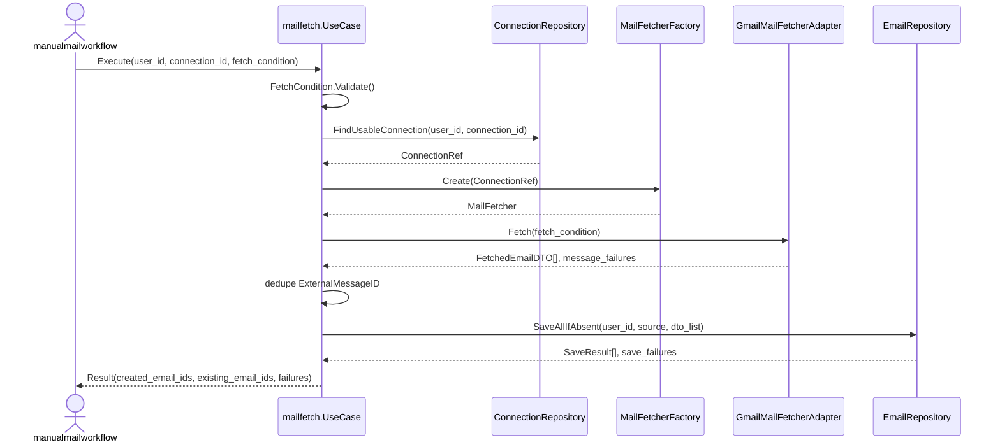

# internal/mailfetch 設計

## 1. 設計方針

- `internal/mailfetch` は `manualmailworkflow` 配下の 1 stage として扱う。
- 責務は「取得条件の検証」「接続解決」「provider 取得」「raw Email 保存」「結果返却」に限定する。
- AI 解析、請求判定、下流 stage の起動は持たない。
- provider 差分は `MailFetcherFactory` と `MailFetcher` adapter で吸収する。
- raw メールの provider 正規化には既存の `internal/common/domain.FetchedEmailDTO` を再利用する。
- Email 保存は `user_id + external_message_id` で idempotent にする。

## 2. package 構成

### `internal/mailfetch/application`

- `UseCase`
- `Command`, `Result`
- port interface
- result summary 組み立て

### `internal/mailfetch/domain`

- `FetchCondition`
- `ConnectionRef`
- `EmailSource`
- `SaveResult`
- `MessageFailure`
- domain error

補足:
- `Email` 本体は `internal/common/domain` と整合させる。
- `mailfetch` 固有 domain は「取得条件」「取得元」「結果要約」のような workflow 境界の型に限定する。

### `internal/mailfetch/infrastructure`

- `MailAccountConnectionReaderAdapter`
- `DefaultMailFetcherFactory`
- `GmailMailFetcherAdapter`
- `GmailSessionBuilder`
- `GormEmailRepositoryAdapter`

## 3. UseCase 契約

```go
type Command struct {
	UserID       uint
	ConnectionID uint
	Condition    domain.FetchCondition
}

type Result struct {
	Provider           string
	AccountIdentifier  string
	MatchedMessageCount int
	CreatedEmailIDs    []uint
	ExistingEmailIDs   []uint
	Failures           []domain.MessageFailure
}

type UseCase interface {
	Execute(ctx context.Context, cmd Command) (Result, error)
}
```

補足:
- `CreatedEmailIDs` は下流 stage へ渡す正規 output とする。
- `ExistingEmailIDs` は idempotent 実行の観測と運用確認に使う。
- `Failures` は message 単位の部分失敗を返す。
  - save 失敗は内部的には 20 件チャンク単位で判定し、失敗したチャンク内の message を `save` failure として返す。
- connection 解決失敗や provider 初期化失敗のような stage 全体失敗は `error` で返す。

## 4. domain 設計

### `FetchCondition`

```go
type FetchCondition struct {
	LabelName string
	Since     time.Time
	Until     time.Time
}
```

ルール:
- `LabelName` は必須
- `Since` / `Until` は必須
- `Since` は `Until` より前
- タイムゾーンは入力値を尊重しつつ、比較は絶対時刻で行う

### `ConnectionRef`

```go
type ConnectionRef struct {
	ConnectionID      uint
	UserID            uint
	Provider          string
	AccountIdentifier string
}
```

役割:
- application 層が provider 選択と保存 source を判断するための最小情報
- token そのものは含めない
- `AccountIdentifier` はメールの `To` ではなく、接続済み mailbox 自体の識別子を表す
  - Gmail では連携済み Gmail アドレス

### `EmailSource`

```go
type EmailSource struct {
	Provider          string
	AccountIdentifier string
}
```

役割:
- Email 保存時の source metadata
- Email の idempotency key に使用する

### `SaveResult`

```go
type SaveStatus string

const (
	SaveStatusCreated  SaveStatus = "created"
	SaveStatusExisting SaveStatus = "existing"
)

type SaveResult struct {
	EmailID           uint
	ExternalMessageID string
	Status            SaveStatus
}
```

### `MessageFailure`

```go
type MessageFailure struct {
	ExternalMessageID string
	Stage             string
	Code              string
}
```

`Stage` 例:
- `fetch_detail`
- `normalize`
- `save`

## 5. port 設計

### application port

```go
type ConnectionRepository interface {
	FindUsableConnection(ctx context.Context, userID, connectionID uint) (domain.ConnectionRef, error)
}

type MailFetcherFactory interface {
	Create(ctx context.Context, conn domain.ConnectionRef) (MailFetcher, error)
}

type MailFetcher interface {
	Fetch(ctx context.Context, cond domain.FetchCondition) ([]common.FetchedEmailDTO, []domain.MessageFailure, error)
}

type EmailRepository interface {
	SaveAllIfAbsent(ctx context.Context, userID uint, source domain.EmailSource, dtos []common.FetchedEmailDTO) ([]domain.SaveResult, []domain.MessageFailure, error)
}
```

設計意図:
- `MailFetcher` は provider 取得までを責務とし、永続化しない。
- `EmailRepository` は source metadata と `user_id` を受け取り、保存キーおよび batch 保存の責務を持つ。
- `dto common.FetchedEmailDTO` を直接受けるのは、provider payload から永続化に必要な metadata をそのまま切り出せるためである。
- `Body` は DTO に存在しても保存対象ではなく、必要なら同一実行内の一時データとしてのみ扱う。

## 6. 実行フロー



## 7. UseCase 詳細

1. `Command` を検証する。
2. `FetchCondition` を検証する。
3. `ConnectionRepository.FindUsableConnection` で所有関係と利用可能性を確認する。
4. `MailFetcherFactory.Create` で provider に応じた fetcher を選ぶ。
5. `MailFetcher.Fetch` で provider から `FetchedEmailDTO` を取得する。
6. 同一レスポンス内で `ExternalMessageID` が重複していた場合は usecase 内で一度だけ保存対象にする。
7. 同一レスポンス内で重複を除いた DTO 群を `EmailRepository.SaveAllIfAbsent` へ 1 回渡す。
8. `SaveStatus` に応じて `CreatedEmailIDs` / `ExistingEmailIDs` を振り分ける。
9. provider 取得の部分失敗と、batch 保存から返る保存失敗を `Failures` に集約して返す。

補足:
- `mailfetch` は `emailanalysis` を直接呼ばない。
- `manualmailworkflow` は通常 `CreatedEmailIDs` のみを次段へ流す。

## 8. Gmail adapter 設計

### 8.1 採用コンポーネント

- `internal/mailaccountconnection/infrastructure.Repository`
- `internal/library/crypto.Vault`
- `internal/library/gmailService.OAuthConfigLoader`
- `internal/library/gmailService.Client`
- `internal/library/gmail.Client`

### 8.2 `GmailSessionBuilder`

役割:
- 対象 connection の credential を取得する
- 暗号化 token を復号する
- `oauth2.Token` を組み立てる
- `gmail.Service` を生成する

必要な追加点:
- `mailaccountconnection` 側 read adapter には `FindCredentialByIDAndUser` 相当の読み取りが必要
  - 現行 repository は `DeleteCredentialByIDAndUser` は持つが、ID 指定の読み取りはないため

### 8.3 `GmailMailFetcherAdapter`

役割:
- Gmail session を使って message ID 一覧を取得する
- 各 message ID の detail を取得する
- `FetchedEmailDTO` に変換する
- `until` 条件で detail 後 filter する

処理詳細:
1. `GetMessagesByLabelName(label_name, since)` を呼ぶ
2. 返ってきた message ID ごとに `GetGmailDetail` を呼ぶ
3. `ReceivedAt < since` または `ReceivedAt >= until` のものを除外する
4. detail 取得失敗は `MessageFailure{Stage: "fetch_detail"}` として記録し、残りを継続する

補足:
- 既存 Gmail client は HTML を strip した本文文字列を `FetchedEmailDTO.Body` へ入れる
- ただし `mailfetch` は本文を保存しない
- 本文が必要な下流は fetch 結果の引き継ぎ、または provider 再取得で補う
- raw MIME や添付ファイルは v1 の責務に含めない
- label が存在しない場合は top-level error `ErrProviderLabelNotFound` を返す

## 9. EmailRepository 設計

### 9.1 保存モデル

`emails` テーブルの想定列:

| 列名 | 用途 |
| --- | --- |
| `id` | PK |
| `user_id` | 所有ユーザー |
| `provider` | `gmail` など |
| `account_identifier` | 取得元 mailbox の識別子。Gmail では連携済み Gmail アドレス |
| `external_message_id` | provider 側 message ID |
| `subject` | 件名 |
| `from_raw` | 生の From |
| `to_json` | 宛先一覧 |
| `received_at` | 受信日時 |
| `created_at` | 作成日時 |
| `updated_at` | 更新日時 |

### 9.2 一意キー

```text
UNIQUE KEY (user_id, external_message_id)
```

理由:
- 同一メールの再取得時に、source metadata の違いに引きずられず 1 Email として扱える
- `connection_id` のような内部 row ID に依存しないため、connection の物理削除と整合する
- provider / `account_identifier` は再取得や監査用 metadata として別途保持できる

### 9.3 保存アルゴリズム

1. usecase から渡された DTO 群を `external_message_id` 単位で正規化・重複除去する
2. DTO 群を 20 件単位の chunk に分割する
3. chunk ごとに `created_run_id` を払い出す
4. `user_id + external_message_id` の一意キーで batch insert (`ON CONFLICT DO NOTHING`) する
5. chunk の insert が成功した場合だけ、commit 後に同じキー群を再検索し、`created_run_id` が今回の run ID と一致する row を `created` と判定する
6. chunk の insert が失敗した場合は、その chunk 内の message をすべて `MessageFailure{Stage: "save"}` として返し、次の chunk を継続する
7. `SaveResult` は成功した chunk 分だけ入力順に組み立てる

補足:
- `to_json` は JSON もしくは text(JSON encode) のどちらでもよいが、配列を失わないこと
- 本文が必要な場合に備え、`provider + account_identifier + external_message_id` で再取得可能な source 情報を欠かさず保持する
- `account_identifier` はメール本文やヘッダの `To` ではなく、取得元 mailbox の snapshot として扱う
- `created_run_id` は「今回の batch が実際に insert した row」を識別するための技術カラムであり、ビジネスキーには含めない
- batch 保存の単位は mailfetch stage 内に限定し、workflow 全体を 1 transaction にしない
- chunk の insert 失敗時は `user_id`, `provider`, `chunk_start_index`, `chunk_size`, `chunk_external_message_ids` を構造化ログへ出す

## 10. エラー設計

### top-level error

- `ErrFetchConditionInvalid`
- `ErrConnectionNotFound`
- `ErrConnectionUnavailable`
- `ErrProviderUnsupported`
- `ErrProviderLabelNotFound`
- `ErrProviderSessionBuildFailed`
- `ErrProviderListFailed`

用途:
- stage 全体を開始できない、または一覧取得自体に失敗した場合

### partial failure

- message detail 取得失敗
- message 正規化失敗
- 20 件チャンク単位の Email 保存失敗
  - failure の返却自体は message 単位で行い、失敗チャンク内の message を `save` failure として返す

用途:
- `Result.Failures` に積み、他 message は継続する

### 将来 HTTP へマップする場合の目安

| domain error | HTTP |
| --- | --- |
| `ErrFetchConditionInvalid` | `400 invalid_request` |
| `ErrConnectionNotFound` | `404 mail_account_connection_not_found` |
| `ErrConnectionUnavailable` | `409 mail_account_connection_unavailable` |
| `ErrProviderUnsupported` | `400 unsupported_mail_provider` |
| `ErrProviderLabelNotFound` | `404 mail_label_not_found` |
| `ErrProviderSessionBuildFailed` | `503 mail_provider_unavailable` |
| `ErrProviderListFailed` | `503 mail_provider_unavailable` |

## 11. DI 方針

- `internal/di/mailfetch.go` を追加する
- Provide 対象
  - `MailAccountConnectionReaderAdapter`
  - `GormEmailRepositoryAdapter`
  - `GmailSessionBuilder`
  - `DefaultMailFetcherFactory`
  - `mailfetch/application.UseCase`

依存関係:
- connection 読み取り adapter は `mailaccountconnection` infrastructure と `crypto.Vault` を再利用する
- Gmail adapter は `gmailService.Client` と `gmail.Client` を再利用する

## 12. テスト観点

### UseCase

- 正常系: すべて新規保存
- 正常系: 新規と既存が混在
- 異常系: `FetchCondition` 不正
- 異常系: 他ユーザーの connection 指定
- 異常系: unsupported provider
- 部分成功: 一部 detail 失敗でも残りを保存する

### Gmail adapter

- label 不存在時に `ErrProviderLabelNotFound`
- token 復号失敗
- `until` filter が効く
- detail 取得失敗を `MessageFailure` に変換する

### EmailRepository

- 初回保存で created
- 同一 `user_id + external_message_id` で existing
- 別 `account_identifier` でも同じ `external_message_id` なら同一 Email として扱われる
- 20 件 chunk の insert が失敗しても後続 chunk を継続する
- chunk 失敗時に chunk 情報をログへ出す

## 13. 今回の判断

- `mailfetch` は `manualmailworkflow` から呼ばれる stage package とする
- v1 provider は Gmail のみ
- provider 正規化 DTO は `internal/common/domain.FetchedEmailDTO` を再利用する
- Email 保存は metadata のみに限定する
- Email の一意キーは `user_id + external_message_id` にする
- Email 保存 port は `SaveAllIfAbsent` とし、保存クエリは 20 件単位で batch 化する
- 戻り値は `CreatedEmailIDs` と `ExistingEmailIDs` を分ける
