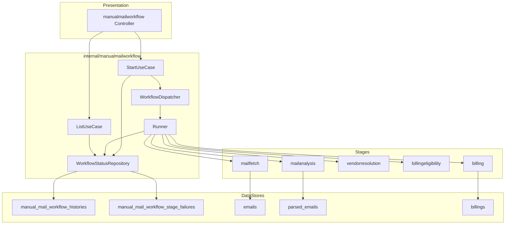
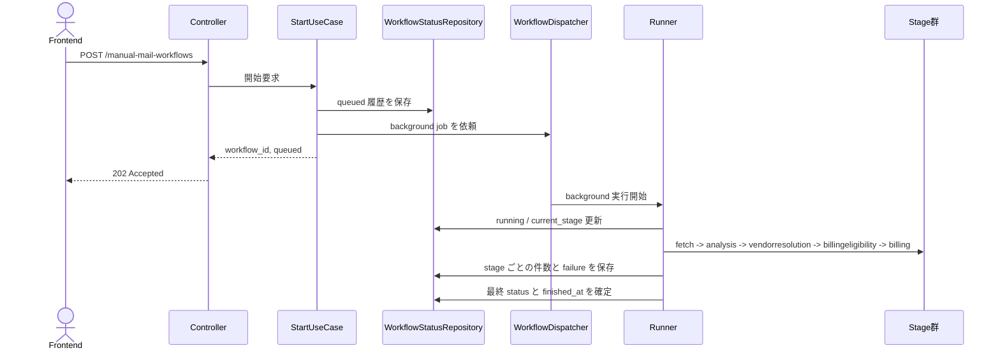
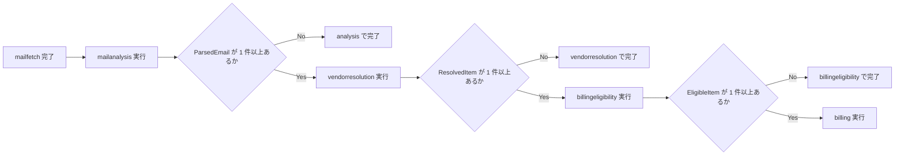
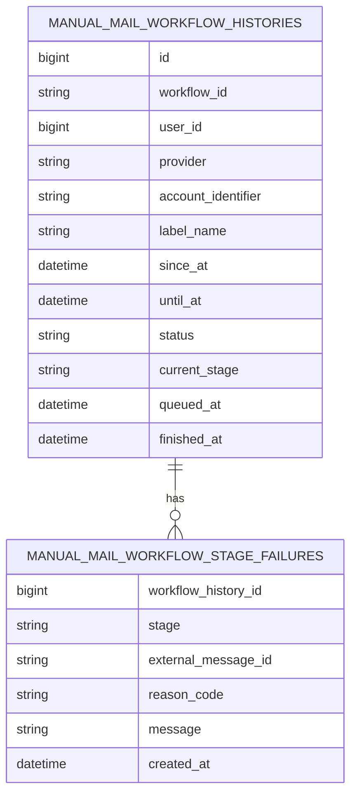

# 手動メール取得アーキテクチャ 基本設計

## 本書の位置づけ

- 本書は `manualmailworkflow` の基本設計をまとめる。
- 要件定義は [requirementsDefinition.md](./requirementsDefinition.md) を参照する。
- 詳細設計は [detailDesign.md](./detailDesign.md) を参照する。

## 設計方針

- `manualmailworkflow` は非同期 workflow の受付、進行管理、履歴集約を担う。
- `mailfetch`、`mailanalysis`、`vendorresolution`、`billingeligibility`、`billing` は個別業務ロジックを担当し、`manualmailworkflow` は orchestration に徹する。
- workflow 履歴は header と failure 明細に分けて保存し、JSON カラムは使わない。
- header は stage 件数に加え、workflow 全体を失敗させた top-level error message を保持できる。
- failure 明細は `ManualMailWorkflowHistory` 配下の child として扱い、独立した surrogate key も dedupe 用の一意制約も持たない。
- stage 間のデータ受け渡しは workflow payload を優先する。
- technical failure と業務上の未解決・不成立・重複は区別して扱うが、workflow 履歴上は stage ごとの failure として集約する。

## 全体構成

## 責務分割

| 対象 | 役割 | やらないこと |
| --- | --- | --- |
| `internal/app/presentation/manualmailworkflow` | HTTP 入力の受け取り、application 入力 DTO への変換、HTTP ステータスとレスポンスへの変換 | stage 個別業務ロジック、DB 直接操作 |
| `internal/manualmailworkflow` | workflow 受付、background dispatch、stage 実行順制御、履歴 read/write、履歴一覧取得 | Gmail/OpenAI/Gorm の直接利用、stage 個別判断 |
| `internal/mailfetch` | 取得条件検証、連携確認、provider 取得、`Email` 保存 | AI 解析、Vendor 解決、Billing 生成 |
| `internal/mailanalysis` | AI 解析、`ParsedEmail` 保存、解析 payload 返却 | 外部メール取得、Vendor 解決、Billing 生成 |
| `internal/vendorresolution` | canonical Vendor 解決、resolved / unresolved 返却 | 請求成立判定、Billing 保存 |
| `internal/billingeligibility` | 請求成立可否判定、eligible / ineligible 返却 | Vendor 解決、Billing 保存 |
| `internal/billing` | Billing 生成、idempotent 保存、created / duplicate / failure 集約 | メール取得、AI 解析、Vendor 解決 |

## 受付から完了までの流れ

## stage 連鎖と skip 方針

## 履歴データの概念モデル

## 状態設計

| 状態 | 意味 |
| --- | --- |
| `queued` | 受付済み。まだ background 実行に入っていない状態 |
| `running` | background 実行中。`current_stage` が進行中の stage を示す |
| `succeeded` | workflow が完走し、どの stage にも failure が残らなかった状態 |
| `partial_success` | workflow は完走したが、いずれかの stage に failure が残った状態 |
| `failed` | dispatch 失敗、stage top-level error、panic などで workflow 自体が完走できなかった状態 |

## 件数集約の基本ルール

| stage | success に数えるもの | business failure に数えるもの | technical failure に数えるもの |
| --- | --- | --- | --- |
| `fetch` | 新規保存と既存再検出 | なし | 取得・保存失敗 |
| `analysis` | `ParsedEmail` として保存できた件数 | なし | 解析・保存失敗 |
| `vendorresolution` | canonical Vendor を解決できた件数 | 未解決 | technical failure |
| `billingeligibility` | 請求成立と判定できた件数 | 不成立 | technical failure |
| `billing` | 新規 Billing を作成できた件数 | duplicate | technical failure |

## failure 集約の基本ルール

| stage | workflow 履歴に残す failure の考え方 |
| --- | --- |
| `fetch` | message 単位の取得失敗・保存失敗を `reason_code` と表示用 `message` 付きで保持する |
| `analysis` | message 単位の解析失敗・保存失敗を `reason_code` と表示用 `message` 付きで保持する |
| `vendorresolution` | 未解決は業務結果として保持し、technical failure と区別して `message` を持たせる |
| `billingeligibility` | 不成立理由を業務結果として保持し、technical failure と区別して `message` を持たせる |
| `billing` | duplicate を業務結果として保持し、technical failure と区別して `message` を持たせる |

## 基本設計上の判断

- `manualmailworkflow` は独自の業務ドメインを増やさず、workflow 管理専用 package として扱う。
- workflow 履歴はユーザー向けの監査情報であり、`emails`、`parsed_emails`、`billings` の正本を置き換えない。
- stage ごとの `business_failure_count + technical_failure_count` と failure 明細件数の整合は各 stage が保証し、workflow 層では明細をそのまま保存する。
- request context は受付までで閉じ、background 実行では新しい context に `request_id`、`job_id`、`user_id` を引き継ぐ。
- dispatcher は interface 越しに使い、in-process 実装から queue 実装へ差し替え可能にする。
