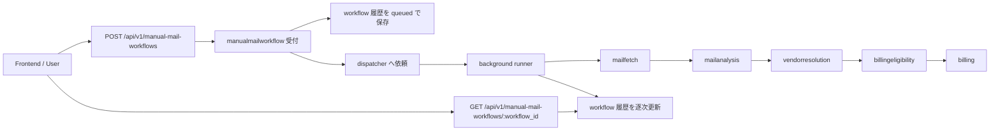
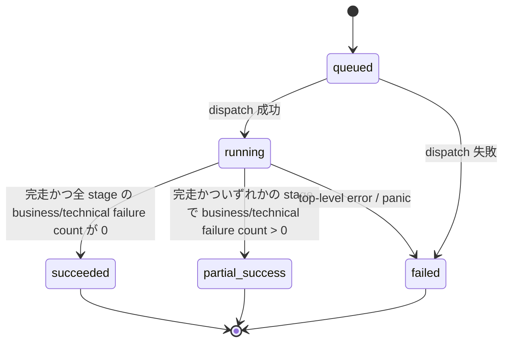

# 手動メール取得アーキテクチャ 要件定義

## 本書の位置づけ

- 本書は `manualmailworkflow` の To-Be 要件を整理する。
- 基本設計は [basicDesign.md](./basicDesign.md) を参照する。
- 詳細設計は [detailDesign.md](./detailDesign.md) を参照する。

## 背景

- DDD 上の `ManualMailFetch` は「手動トリガーで即時実行される Email 取得」であり、Email の意味解釈を持たない。
- 実装上は `mailfetch -> mailanalysis -> vendorresolution -> billingeligibility -> billing` を順に実行し、最終的に `Billing` 生成まで到達する必要がある。
- 現行の同期完了型 API では HTTP リクエストが各 stage の完了まで待つため、応答時間が長くなりやすい。
- 現状の実行結果はログや各 stage の永続化先に散在し、`workflow_id` 単位で「受付条件」「途中経過」「失敗理由」を一貫して辿れない。
- `emails.created_run_id` や `parsed_emails.analysis_run_id` は stage ローカルな識別子であり、workflow 全体の相関 ID には使えない。

## 解決したい課題

- 手動メール取得 API の応答時間を短くし、`POST` は受付だけを返すようにしたい。
- workflow 1 回分の進行状態と最終結果を、`workflow_id` をキーに参照できるようにしたい。
- technical failure と業務上の未解決・不成立・重複を分けつつ、ユーザー向けには stage ごとの failure として見せたい。
- stage 途中で失敗や panic が起きても、それまでの部分結果を履歴から確認できるようにしたい。

## 目標

- `POST /api/v1/manual-mail-workflows` は短時間で `202 Accepted` を返す。
- 実処理は background workflow として順次実行する。
- `workflow_id` ごとに受付条件、状態、stage ごとの成功件数・失敗件数・失敗理由を DB に残す。
- 将来の状態取得 API から workflow の進行状態または最終結果を参照できるようにする。

## 対象範囲

- 手動メール取得 API の非同期受付化
- workflow 履歴保存方式の定義
- workflow 開始 API と将来の状態取得 API の責務定義
- background runner による stage 実行順序の定義
- stage ごとの件数集約と failure 集約の方針
- package 間の責務境界と依存方向の整理

## 非対象

- バッチメール取得
- ジョブキュー製品の最終選定
- Frontend 実装そのもの
- Outlook など Gmail 以外の具体実装

## 想定フロー

## 機能要件

- `FR-1`
  - 手動メール取得開始 API は、入力検証後に workflow を受け付け、処理完了を待たずに受付結果を返す。
- `FR-2`
  - workflow は `mailfetch -> mailanalysis -> vendorresolution -> billingeligibility -> billing` の順で実行する。
- `FR-3`
  - workflow 単位の履歴には、少なくとも `workflow_id`、受付条件、状態、現在 stage、受付時刻、完了時刻を保持する。
- `FR-4`
  - 各 stage ごとに成功件数と失敗件数を保持する。
- `FR-5`
  - 各 stage ごとに、`reason_code` とユーザー表示用 `message` を含む failure 明細を別テーブルに保持する。
- `FR-6`
  - `vendorresolution` の未解決、`billingeligibility` の不成立、`billing` の重複は technical failure とは分けて扱う。
- `FR-7`
  - stage top-level error や panic が起きても、それまでに保存済みの件数と failure reason は失わない。
- `FR-8`
  - 将来の状態取得 API は `workflow_id` を受け取り、workflow の現在状態または最終結果を返せるようにする。
- `FR-9`
  - stage 間のデータ受け渡しは workflow payload を優先し、不要な再読込は増やさない。
- `FR-10`
  - 後続 stage に渡す対象が 0 件のときは、その stage を skip できる。

## 非機能要件

- `NFR-1`
  - HTTP request は受付と dispatch までに責務を限定し、長時間の同期処理を行わない。
- `NFR-2`
  - 履歴は `workflow_id` をキーに監査可能であること。
- `NFR-3`
  - workflow 履歴は JSON カラムを使わず、ヘッダと failure 明細に分けて保持すること。
- `NFR-4`
  - `manualmailworkflow` は orchestration 専用とし、各 stage の個別業務ロジックを内包しないこと。
- `NFR-5`
  - request context を長寿命 goroutine に引き回さず、background 実行では新しい context を使うこと。
- `NFR-6`
  - dispatcher は in-process 実装から queue 実装へ差し替え可能であること。

## 制約・前提

- workflow 履歴は `Email`、`ParsedEmail`、`Billing` の業務データを置き換えない。あくまで workflow のサマリと失敗理由を保持する。
- 履歴ヘッダの主キーは数値 `id` とし、`workflow_id` は API 参照用の一意キーとして扱う。
- 手動 workflow では `queued_at` は保持するが、`started_at` は持たない。
- `emails.created_run_id` や `parsed_emails.analysis_run_id` は workflow 相関キーとして利用しない。
- `Billing` の参照元は `Email` であり、`ParsedEmail` は参照元として保持しない。

## 状態遷移要件

## 成功条件

- 手動メール取得 API が短時間で `202 Accepted` を返せる。
- workflow が background で stage 順に実行される。
- `workflow_id` を相関 ID として扱い、履歴から進行状態または最終結果を取得できる。
- `queued` / `running` / `succeeded` / `partial_success` / `failed` の状態遷移が DB に残る。
- stage 途中で失敗や panic が起きても、その時点までの部分結果を履歴から確認できる。
- 各 package の責務境界を崩さず、既存 stage 実装を流用できる。
